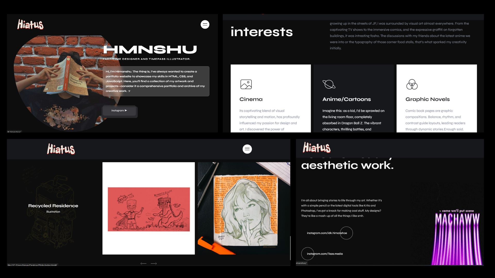

# artist-portfolio
This project showcases my skills in HTML, CSS, and JavaScript through a visually engaging and interactive site. Here’s a bit more about what you’ll find:

## Overview
HMNSHU is a portfolio website designed to highlight my work and interests. It’s crafted to be a blend of my passion for design and art, with a focus on providing an engaging user experience. The website features:

- **Hero Section**: An introduction to who I am, with a personal touch.
- **Interests**: A look at what inspires me, including cinema, anime, and graphic novels.
- **Skills**: A showcase of my artistic capabilities and the tools I use.
- **Portfolio**: A gallery of my recent works with descriptions.
- **Contact**: Information on how to get in touch with me.
## Features

- **Responsive Design**: Optimized for both desktop and mobile devices.
- **Glassmorphism Effect**: Modern visual aesthetics with a frosted glass effect.
- **Interactive Slider**: A dynamic portfolio slider to view different projects.
## Technologies Used
- **HTML5**: For structuring the content.
- **CSS3**: For styling, including custom effects and responsive design.
- **JavaScript**: For interactive elements and dynamic content.
## LinkedIn: Himanshu Mahesh

## Acknowledgements

- **Design Inspiration**: Various YouTube videos that provided valuable insights and inspiration for the design and functionality of this project.
- **Fonts**: [Google Fonts](https://fonts.google.com/) for typography.
- **Icons**: [Ionicons](https://ionicons.com/) for iconography.
